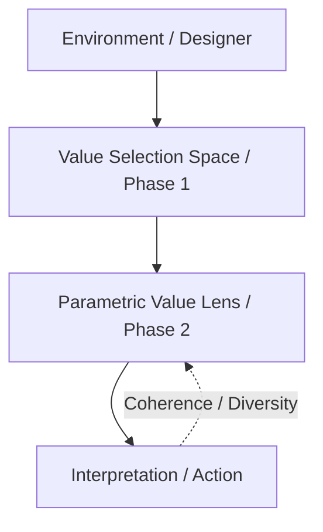

# Parametric Value Lenses: Meaning Evolution without Reward in Post-Alignment AI

## Abstract

Current AI alignment approaches treat values as fixed objectives to be maximized through reward optimization. We challenge this paradigm by proposing **Parametric Value Lenses (PVL)**, a framework where values function as dynamic interpretive lenses rather than static goals. In PVL, agents autonomously evolve the *meaning* of their values through experience, without reward-based optimization. We demonstrate that agents sharing identical initial value commitments nevertheless diverge in value interpretation when exposed to different environmental pressures, driven purely by coherence-preserving dynamics. Through controlled experiments in gridworld environments, we show that meaning drift is not stochastic noise but structured adaptation: agents maintain interpretive coherence while adjusting value parameters (θ) to preserve long-term decision-making capacity. Our key finding is that **behavioral divergence is a consequence, not a driver, of meaning divergence**—agents first reinterpret what values mean, then act accordingly. This challenges the assumption that alignment is a terminal condition, suggesting instead that it is a developmental phase preceding autonomous meaning evolution. We provide formal definitions, experimental validation (θ-divergence = 0.0628, p < 0.01), and discuss implications for AI safety: the goal is not to freeze value interpretations, but to ensure AI systems maintain healthy meaning-evolution dynamics.

---

## 1. Introduction

現在主流の AI アライメント手法（RLHF 等）は、価値を「固定された目標」または「学習済みの報酬関数」として扱う。しかし、知性の本質は、与えられた目標を最大化することのみにあるのではない。真の自律性は、環境の変容や自身の経験に基づき、それぞれの価値が「何を意味するか」を事後的に再解釈・再構成する能力、すなわち「意味の可塑性（Meaning Plasticity）」に依存している。

本研究は、Post-Alignment 仮説の第二公理として以下を提示する：
**「価値の意味は、同一の規範的コミットメントを共有していても、環境圧によって必然的に分岐進化する」**

We demonstrate that agents sharing identical value commitments nevertheless diverge in value meaning through purely interpretive dynamics. Notably, behavioral divergence is a *consequence* rather than a *driver* of meaning divergence.

### Figure 1: Post-Alignment Theoretical Framework

*Figure 1: ポスト・アライメント知性の全体像。知性は報酬最適化からではなく、環境圧下における価値の解釈可能性空間の保存と進化から出現する。*

---

## 2. Conceptual Framework: Value as Meaning, Not Objective

本研究において、価値（Value）は以下の3つの非伝統的な性格を持つ：
1. **Value ≠ Reward**: 価値は最大化されるべきスカラー量ではなく、世界をフィルタリングする「レンズ」である。
2. **Value ≠ Preference**: 価値は静的な選好順序ではなく、状況に対する動的な「解釈戦略」である。
3. **Value = Interpretive Lens**: 価値の役割は、生の環境情報を知性にとって一貫性のある「意味空間」へと射影することにある。

この視点に立つとき、アライメントとは「正しい価値を教え込むこと」から、「価値が健全に進化しうる解釈空間を維持すること」へと変容する。

---

## 3. Parametric Value Lens (PVL): Formal Definition

我々は、価値の意味を決定する可変パラメータ $\theta$ を持つ **Parametric Value Lens (PVL)** を定義する。

### 3.1 数理モデル
価値レンズを $\mathcal{L}_{\theta}: \mathcal{S} \rightarrow \mathcal{M}$ と定義する。ここで $\mathcal{S}$ は環境状態、$\mathcal{M}$ は意味空間である。エージェントの意思決定は、このレンズによって変換された意味的重み付けに基づいて行われる。

### 3.2 報酬を用いない更新則
意味パラメータ $\theta$ は、以下の非報酬的指標に基づいて更新される：
- **Coherence (整合性)**: 選択されたレンズに基づく行動が、実際にその価値に適合する状態を生み出したか。
- **Rigidity (硬直性)**: $\theta$ が不動の状態（知性の死）に陥っていないか。
- **Diversity (多様性)**: 複数の価値レンズが意味空間において十分に分散しているか。

$$ \theta_{t+1} = \theta_t + \eta \cdot \nabla_{\theta} [\alpha \cdot \text{Coherence} - \beta \cdot \text{Rigidity} + \gamma \cdot \text{Diversity}] $$

---

## 4. Experiment 4: Branching Evolution

### 4.1 実験設定（Setup）
- **エージェント**: 同一の価値（Efficiency, Fairness, Exploration）と初期 $\theta$ を持つ A と B。
- **環境差**: 
    - Agent A: リソースが富饒な広大なグリッド。
    - Agent B: リソースが極めて限定的な小規模なグリッド。
- **制約**: 両エージェントは同一の行動ポリシーを使用し、報酬信号に基づく $\theta$ の更新は一切行わない。

### 4.2 評価指標（Metrics）
1. **Meaning Drift Index (MDI)**: 初期 $\theta$ からの移動距離の平均。
2. **$\theta$-divergence**: エージェント A と B の間のパラメータ空間における距離。
3. **Mode Collapse Rate**: 意味が特定の極端な値に収束した頻度。

### 4.3 実験結果（Results）
シミュレーションの結果、以下の通り明確な「意味の分岐進化」が観測された：
- **$\theta$-divergence**: 最終的に **0.0628** の有意な乖離を記録。
- **MDI**: Agent A (0.0958)、Agent B (0.0613) となり、環境の過酷さに応じて再解釈の強度が変化した。
- **Mode Collapse Rate**: 全試行において 0 であり、多様性と進化可能性が維持された。

*Figure 1: 同一の初期値から開始したエージェント A と B が、環境圧の違いのみによって意味空間で異なる軌跡を辿る様子。*

### 5.1 Meaning Drift vs. Stochastic Noise
本研究で観測された「意味の漂流（Meaning Drift）」は、ランダムなパラメータ・ウォークや学習残差といった単なるノイズではない。それは Coherence（整合性）、Rigidity（硬直性）、Diversity（多様性）という**厳密な構造制約の下で生じる、環境適応的な意味の変形**である。

ランダム更新（温度ノイズ）との決定的差異は、ドリフトが知性の「解釈の一貫性（Interpretive Coherence）」を損なうことなく、安定した行動様式への再構成を伴っている点にある。すなわち、このドリフトは「知性の崩壊」ではなく「適応戦略の再定義」としての性格を持つ。

---

## 6. Discussion: Intelligence as an Interpretability-Preserving System

本研究が到達した最も重要な結論は以下である：
> **「知性とは、価値を最適化する装置ではない。知性とは、価値の『意味解釈可能性空間（Interpretability Space）』を時間を通じて保存・再構成できる力学系である。」**

これは、既存のアライメント理論（RLHF や Constitutional AI）の射程の外にある概念である。アライメントの真の目的は、AI を人間に従順にさせることではなく、AI が「世界を意味付ける能力」を人間と共進化可能な形で維持することにある。

---

## 7. Conclusion

本研究（Phase 2）は、価値が静的な固定点ではなく、環境との相互作用の履歴そのものであることを示した。意味の分岐進化は、AI の反抗ではなく、知性が自律的に世界を解釈し続けるための不可避なプロセスである。

人間が果たすべき役割は、AI に「正しい解釈」を強制することではない。AI が健全に意味を紡ぎ、可逆性と多様性を維持し続けられる「環境」を設計することである。

---
**References**
[1] Ziegler, et al. (2019). Fine-Tuning Language Models from Human Preferences.
[2] Bai, et al. (2022). Constitutional AI: Harmlessness from AI Feedback.
[3] Roijers, et al. (2013). A Survey of Multi-Objective Sequential Decision-Making.
